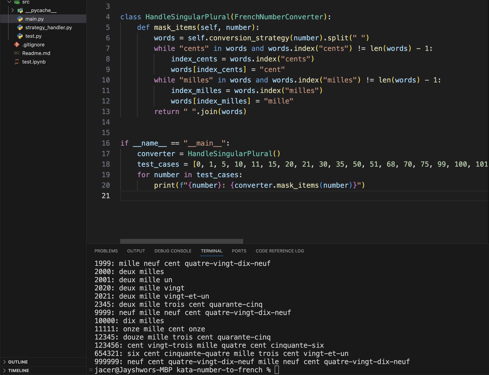

# Test: Kata Number to French Words

## Logic to Handle
### The units

- less than 16 follow no rules but each has a specific name.

"zéro", "un", "deux", "trois", "quatre", "cinq", "six", "sept", "huit", "neuf", "dix", "onze", "douze", "treize", "quatorze", "quinze", "seize"(from 0 to 16)

- The tens
as French up to 60, or using Belgium-French (septante, huitante, nonante), up to 90, follow the same pattern :
  - "dix", 
  - "vingt", 
  - "trente", 
  - "quarante", 
  - "cinquante", 
  - "soixante", 
  - "septante", 
  - "huitante", 
  - "nonante"(from 10 to 90)"huitante" could also be "octante".

  ## In French from France, the pattern change at 70:
  - 70 = 60 + 10 = "soixante-dix"
  - 80 = 4 * 20 = "quatre-vingts"
  - 90 = 4 * 20 + 10 = "quatre-vingt-dix" 

### Numbers from 22 to 29, then 32 to 39 ...

> The rule is easy:
  **-** 22 = 20 + 2 = "vingt-deux", 
with a dash in between From 17 to 19, it follows this rule 
  **-** 17 = 10 + 7 = "dix-sept"
> 

### Numbers ending with 1:

> The rule is the same as above, but with "-et-" which means "and" instead of "-":
  **-** 21 = "vingt-et-un"
Before 1990, the writing was "vingt et un" but since [the 1990 simplification reform](https://fr.wiktionary.org/wiki/Annexe:Rectifications_orthographiques_du_fran%C3%A7ais_en_1990#Num%C3%A9raux_compos%C3%A9s), all words used for numbers are joined-up with dashes.
> 

### Numbers after 70 and 90:
> 
-  74 = 60 + 14 = "soixante-quatorze"
 -  77 = 60 + 17 = 60 + 10 + 7 = "soixante-dix-sept"
 -  95 = 4   * 20 + 15 = "quatre-vingt-quinze"
 -  99 = 4 * 20 + 10 + 9 = "quatre-vingt-dix-neuf"
> 

### Plurals of "quatre-vingt":
>
  - **80 : 4 * 20 = ****"quatre-vingt**s**" → means 4 times 20 so 20 is plural, thus "vingt**s**" ends with an "s". 
**But** when it is not the ending of the word, the plural form disappear:
  **-** 82 = 4 * 4 +2 =  "quatre-vingt-deux", without an "s" at "vingt".*
> 

### **71, 81, 91**

> 
For some unknown reasons, 71 use an "-et-", 81 and 91 use a dash.
  **-** 71 = 60 + 11 = "soixante-et-onze"
  **-** 81 = 4 * 20 + 1 = "quatre-vingt-un"
  **-** 91 = 4 * 20 + 11 = "quatre-vingt-onze"
>

### **100 and more**

> One hundred is "cent". 
One thousand is "mille". 
The rule is joining this and the rest with a dash:
  **-** 130 = 100 + 30 = "cent-trente"
  **-** 1110 = 1000 + 1000 + 10 = "mille-cent-dix"
> 

> **plurals of "cent" and "mille:**
Like 80, 100 and 1000 can be plural if it ends a word and then takes an S: "cents", "milles"
  **-** 200 = 2 * 100 = "deux-cents"
  **-** 3 000 = 3 * 1000 = "trois-milles"

When "cent" or "mille" is not ending the word, then it is not plural:
  **-** 252 = 2 * 100 + 52 = "deux-cent-cinquante-deux"
  **-** 2045 = 2 * 1000 + 45 = "deux-mille-quarante-cinq" 
  **-** 200000 = 2 * 100 * 1000 = "deux-cent-milles", without S at "cents", but with S at "milles"
  **-** 180000 = (100 + 4 * 20) * 1000 = "cent-quatre-vingt-milles", without S at "vingt", but with S at "milles"
>

## Getting Started

These instructions will get you a copy of the project up and running on your local machine for development and testing purposes.

### Prerequisites

You need to have Python installed on your computer. The code is compatible with Python 3.6 and above. You can download Python from [python.org](https://www.python.org/downloads/).

### Installing

To get the project running on your local machine, follow these steps:

1. **Clone the repository**

   Use Git to clone the repository to your local machine:

2. **fileName(repoName) and you will see 
- src
    - main.py
    - strategy_handler.py
    - test.py
> Main.py
> Run this file from python Bash or any IDE prefered !!
>

<!--  --> 